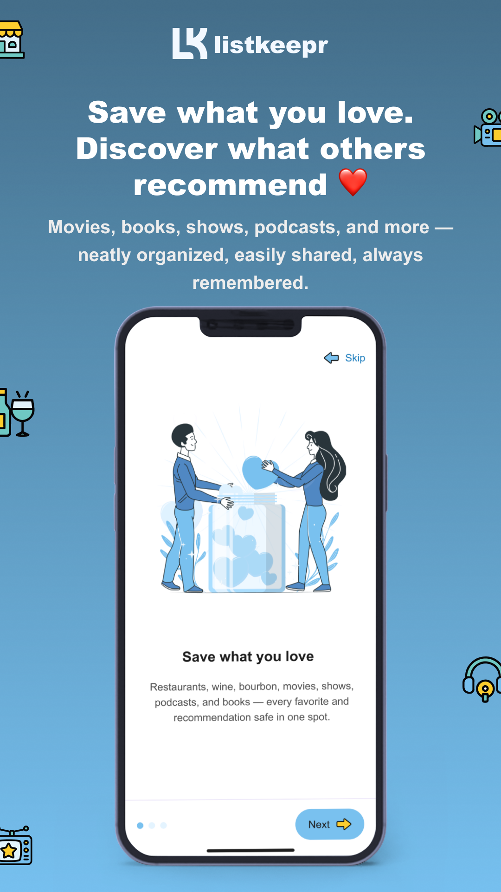
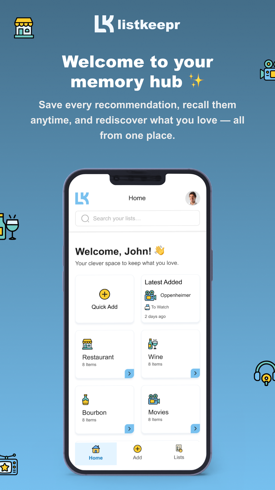
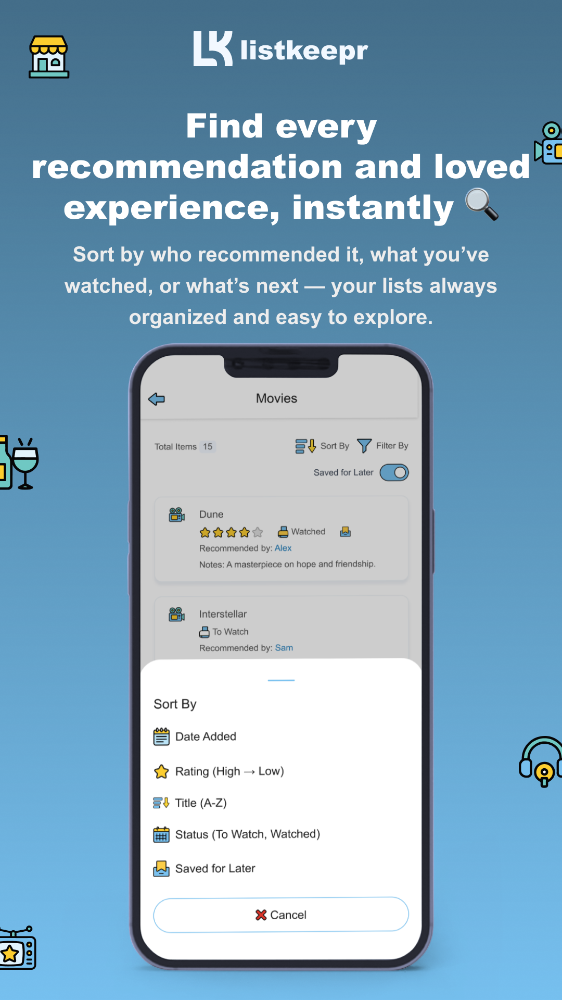
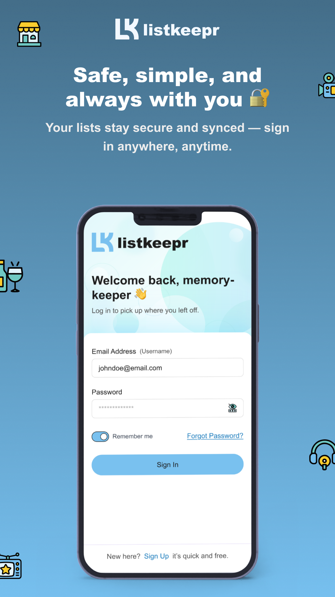
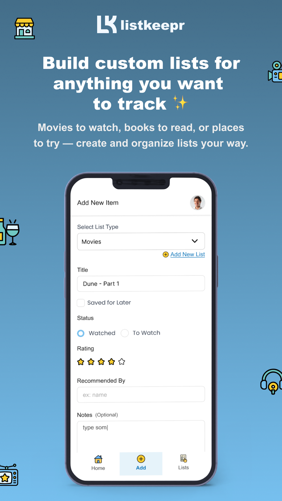

# ListKeepr

> **A personal recommendation tracker and favorites organizer built with React Native and Supabase.**

ListKeepr helps users save, organize, and revisit the things they love — from books, movies, restaurants, podcasts, wine, and beer to completely custom lists.

Instead of relying on scattered notes or trying to remember recommendations from friends, ListKeepr keeps everything organized in one place.

**Save it once. Never forget it again.**

---

## 📱 App Preview

<p align="center">
  
  
  
</p>

<p align="center">
  
  
</p>

---

## 🚀 Overview

ListKeepr is designed to make personal recommendations easy to capture, organize, and revisit.

Users can create categorized lists, save individual items, add ratings and notes, record who recommended something, and track whether an item has already been experienced or is still on their list.

The application also supports custom lists, allowing users to track virtually anything they want.

Examples:

* 🎬 Movies to watch
* 📚 Books to read
* 🍽️ Restaurants to try
* 🍷 Wines to remember
* 🎙️ Podcasts to listen to
* 🏠 Home contractors
* ✈️ Vacation must-dos
* 💡 Inspirational ideas

---

## ✨ Key Features

### 📋 Smart Lists

* Create and manage categorized lists
* Support for movies, books, restaurants, podcasts, wine, beer, and more
* Create custom lists for any type of content
* View and organize saved items in one place

### ⭐ Item Management

* Add ratings
* Add personal notes
* Track item status such as **Watched** or **To Watch**
* Mark items as **Saved for Later**
* Record who recommended an item

### 🔎 Search, Sort & Filter

* Search saved lists and items
* Sort items by:

  * Date Added
  * Rating
  * Title
  * Status
  * Saved for Later
* Filter and organize large lists efficiently

### 📚 Book Discovery

* Integrated book search
* Find books directly within the application
* Access purchase links through book results

### 🔐 Authentication

* User registration and login
* Secure authenticated sessions
* Password recovery
* Remember-me functionality

### 🎨 User Experience

* Clean and modern mobile UI
* Responsive layouts
* Reusable UI components
* Simple navigation designed for everyday use

---

## 🛠️ Tech Stack

| Technology                  | Usage                                 |
| --------------------------- | ------------------------------------- |
| **React Native**            | Cross-platform mobile application     |
| **JavaScript / TypeScript** | Application development               |
| **Supabase**                | Backend services and data management  |
| **Supabase Auth**           | User authentication                   |
| **REST / API Integration**  | External and backend data integration |
| **React Navigation**        | Application navigation                |
| **Git / GitHub**            | Version control                       |

---

## 👨‍💻 My Contribution

### ListKeepr — Sole Mobile Developer

I independently designed and developed the mobile application using **React Native and Supabase**.

My responsibilities included:

* Designed and implemented the mobile application
* Developed reusable React Native components
* Implemented application navigation and user flows
* Implemented authentication and user account flows
* Integrated Supabase backend services
* Integrated external APIs for application functionality
* Built list creation and item management functionality
* Implemented search, sorting, and filtering
* Implemented ratings, notes, status, and recommendation tracking
* Developed custom list functionality
* Handled loading, validation, and error states
* Focused on application performance, stability, and maintainability

---

## 🏗️ Engineering Highlights

The project demonstrates practical experience in building and structuring a production-oriented React Native application:

* **Modular React Native architecture** with separate screens, reusable components, navigation, Redux, utilities, and integrations
* **Reusable component architecture** to reduce duplication and improve maintainability
* **Redux-based state management** for centralized application state
* **Supabase integration** for backend services and user authentication
* **API integration** for retrieving and managing application data
* **Authentication flows** including sign-in, sign-up, and password recovery
* **Form handling and validation** for user input and data creation
* **Search, sorting, and filtering** for efficient data discovery
* **Dynamic list rendering** for categorized and user-created lists
* **Responsive mobile UI** designed for different device screen sizes
* **Loading, validation, and error-state handling** across user workflows
* **Android and iOS support** through React Native's cross-platform architecture
* **Maintainable code organization** following separation of concerns between UI, state, navigation, utilities, and service

---

## 📂 Project Structure

```text
keepr/
├── src/
│   ├── assets/          # Images, icons, and other static assets
│   ├── components/      # Reusable UI components
│   ├── constants/       # Application constants and configuration
│   ├── lib/             # Library and service integrations
│   ├── Navigations/     # Navigation configuration and routes
│   ├── redux/           # Redux state management
│   ├── screens/         # Application screens
│   ├── utils/           # Utility and helper functions
│   ├── index.js         # Source entry point
│   └── ...
├── docs/
│   └── screenshots/     # Application screenshots
├── android/             # Android native project
├── ios/                 # iOS native project
├── package.json         # Dependencies and scripts
├── index.js             # React Native entry point
└── README.md
```

---

## ⚙️ Getting Started

### Prerequisites

Make sure you have the following installed:

* Node.js
* npm or Yarn
* React Native development environment
* Android Studio for Android development
* Xcode for iOS development
* CocoaPods for iOS dependencies

### Installation

Clone the repository:

```bash
git clone https://github.com/pardeepsinghps7/keepr.git
cd keepr
```

Install dependencies:

```bash
npm install
```

For iOS:

```bash
cd ios
pod install
cd ..
```

Start the Metro bundler:

```bash
npx react-native start
```

Run Android:

```bash
npx react-native run-android
```

Run iOS:

```bash
npx react-native run-ios
```

---

## 🔐 Environment Configuration

Create the required environment configuration for your Supabase project and API services.

Example:

```env
SUPABASE_URL=your_supabase_url
SUPABASE_ANON_KEY=your_supabase_anon_key
```

> Never commit production credentials, API keys, or private secrets to GitHub.

---

## 📸 Screenshots

### Onboarding

<p align="center">
  
</p>

### Home Dashboard

<p align="center">
  
</p>

### List & Filtering

<p align="center">
  
</p>

### Add New Item

<p align="center">
  
</p>

### Authentication

<p align="center">
  
</p>

---

## 🎯 Project Highlights

ListKeepr demonstrates how a real-world mobile application can combine a polished user experience with backend services and practical data-management workflows.

The application focuses on a simple problem:

> **Recommendations are easy to forget. ListKeepr gives users one place to save, organize, and revisit them.**

---

## 📌 Project Information

**Project:** ListKeepr
**Role:** Sole Mobile Developer
**Platform:** iOS & Android
**Primary Framework:** React Native
**Backend:** Supabase
**Repository:** `keepr`

---

## 👤 Developer

**Pardeep Singh**
Senior Mobile App Developer — React Native | Flutter | Android

* React Native
* Flutter
* Android
* JavaScript / TypeScript
* Mobile Application Architecture
* REST API Integration
* Supabase

---

⭐ If you find this project interesting, feel free to explore the source code and implementation.
